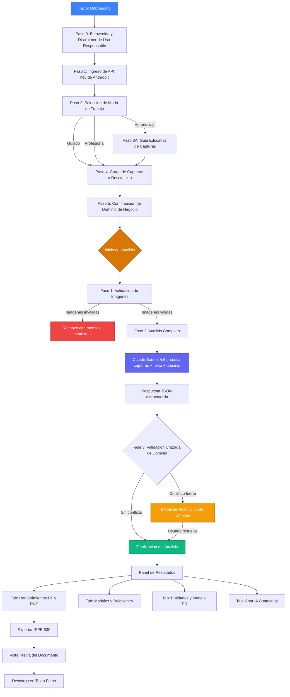
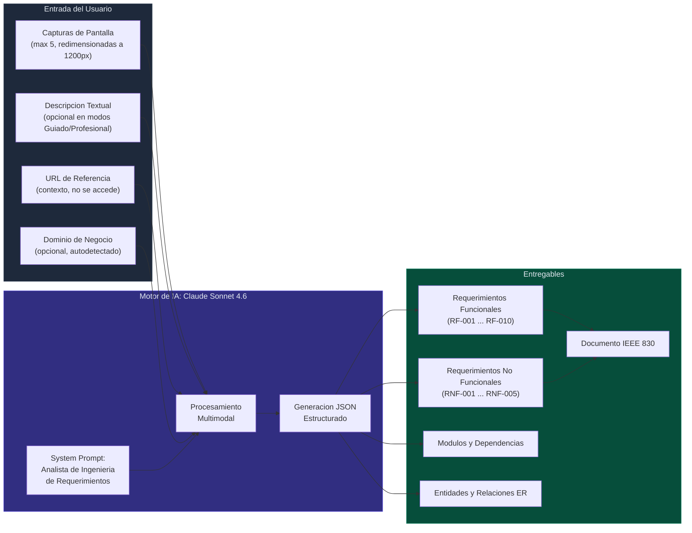

<div align="center">

# ReqLens

### Analisis de Requerimientos por Inspeccion Visual

*Herramienta educativa y profesional que transforma interfaces de software existentes en especificaciones de requerimientos formales mediante Inteligencia Artificial.*

[](LICENSE)
[](https://www.anthropic.com/)
[](https://html.spec.whatwg.org/)
[](#diseno-visual)

---

[Caracteristicas](#caracteristicas-principales) · [Flujo de Procesamiento](#flujo-de-procesamiento) · [Modos de Trabajo](#modos-de-trabajo) · [Estructura](#estructura-del-proyecto) · [Instalacion](#instalacion-y-uso) · [Seguridad](#api-key-y-seguridad)

</div>

---

## Que es ReqLens

**ReqLens** toma lo que cualquier persona puede observar de un sistema de software — sus pantallas, flujos de navegacion y comportamiento visual — y, mediante el motor de **Claude Sonnet 4.6 (Anthropic)**, infiere y construye el levantamiento de requerimientos formal que se necesitaria para reproducirlo desde cero.

La herramienta opera como una aplicacion 100% cliente (frontend puro), sin servidores intermedios. Las llamadas a la API de Anthropic se realizan directamente desde el navegador del usuario.

---

## Caracteristicas Principales

| Capacidad | Descripcion |
| :--- | :--- |
| **Especificacion IEEE 830** | Genera un documento completo de requerimientos funcionales y no funcionales, con vista previa y descarga en texto plano. |
| **Diagrama de Modulos** | Renderiza un mapa arquitectonico interactivo con la estructura, responsabilidades y relaciones de dependencia del sistema analizado. |
| **Modelo Conceptual de Entidades** | Identifica entidades, atributos inferidos (con fuente de origen) y relaciones de cardinalidad. Incluye visualizacion tipo ER en canvas. |
| **Niveles de Confianza** | Cada requerimiento se clasifica con una etiqueta de trazabilidad: `[CONFIRMADO]` (observado directamente), `[INFERIDO]` (estandar del dominio) o `[NO ACCESIBLE]` (oculto tras login o permisos). |
| **Chat con IA Contextual** | Despues del analisis, permite consultar a Claude sobre los resultados generados: Scrum, historias de usuario, definicion de terminado, etc. |
| **Validacion Cruzada de Dominio** | Si el dominio declarado por el usuario no coincide con el detectado por la IA, se presenta un modal de resolucion antes de finalizar. |
| **Tema Claro / Oscuro** | Conmutacion de tema con persistencia en `localStorage`. |
| **Captura de Pantalla Nativa** | Integracion con la API `getDisplayMedia` para capturar pantallas directamente desde el navegador, sin herramientas externas. |
| **100% en Espanol** | Traduce e interpreta interfaces construidas en cualquier idioma al espanol tecnico estandar de ingenieria de software. |

---

## Flujo de Procesamiento

El siguiente diagrama mapea el ciclo completo de analisis, desde la entrada del usuario hasta la generacion de entregables:



### Detalle de las Fases Internas



---

## Modos de Trabajo

ReqLens implementa un onboarding ramificado que ajusta la experiencia de interfaz segun el perfil del usuario:

| Modo | Enfoque | Requisitos de Entrada | Experiencia de Interfaz |
| :--- | :--- | :--- | :--- |
| **Aprendizaje** | Educativo (estudiantes) | Capturas de pantalla obligatorias con validacion previa. Incluye guia paso a paso de que pantallas capturar. | Explicaciones de conceptos de ingenieria de software en cada paso del proceso. |
| **Guiado** | Asistencia moderada | Capturas o texto opcionales. | Avisos puntuales en zonas criticas del analisis, sin tutoriales intrusivos. |
| **Profesional** | Maxima velocidad | Entrada libre (capturas, texto o ambas) con mayor limite de caracteres. | Interfaz directa enfocada a la agilidad de analisis. |

La ramificacion ocurre en el Paso 2 del onboarding: el modo Aprendizaje pasa por una pantalla educativa adicional (Paso 3A) antes de la carga de capturas. Los modos Guiado y Profesional saltan directamente al Paso 4.

---

## Diseno Visual

La interfaz sigue una estetica minimalista premium inspirada en el estilo de Emil Kowalski:

- **Paleta oscura profunda** — fondo base `#060709` con acentos de azul lente (`#3b82f6`) y cian escaneo (`#06b6d4`)
- **Glassmorphism** — cabecera, modales y overlay de carga con `backdrop-filter: blur(12px)` sobre superficies semi-transparentes
- **Microanimaciones** — transiciones `fadeInUp` con curva `cubic-bezier(0.16, 1, 0.3, 1)` en el onboarding y tarjetas de resultado
- **Loader tipo reticula** — anillos concentricos que giran a diferentes velocidades, simulando un lente optico de alta precision
- **Tema dual** — soporte completo para modo claro y oscuro con persistencia en `localStorage`

---

## Estructura del Proyecto

```
ReqLens/
├── index.html    Estructura HTML completa, logica JS (API, canvas, modales, chat, exportacion)
├── style.css     Tokens de diseno, animaciones, responsive layout, tema claro/oscuro
└── README.md     Documentacion del proyecto
```

### Stack Tecnologico

| Componente | Tecnologia | Proposito |
| :--- | :--- | :--- |
| Motor de IA | Claude Sonnet 4.6 (Anthropic) | Analisis multimodal de capturas, inferencia de requerimientos, generacion de documentacion |
| Iconografia | Lucide Icons (CDN) | Sistema de iconos SVG de alta resolucion |
| Tipografia | Google Fonts | Outfit (titulos), Inter (cuerpo), JetBrains Mono (codigo e identificadores) |
| Comunicacion | Anthropic Messages API v2023-06-01 | Llamadas directas desde el navegador via `anthropic-dangerous-direct-browser-access` |

---

## Instalacion y Uso

### Opcion A: Uso Local (Sin Servidor)

1. Descarga o clona el repositorio.
2. Abre `index.html` en cualquier navegador moderno (Chrome, Edge, Firefox, Safari).
3. Ingresa tu API Key de Anthropic, selecciona un modo de trabajo, sube capturas y ejecuta el analisis.

### Opcion B: Clonar el Repositorio

```bash
git clone https://github.com/tu-usuario/reqlens.git
cd reqlens
# Abre index.html en tu navegador
```

### Opcion C: Despliegue en la Nube

El proyecto puede desplegarse directamente en plataformas como **Vercel** o **Netlify**. Al ser una aplicacion puramente frontend, no requiere configuracion de compilacion ni servidores backend.

---

## API Key y Seguridad

ReqLens realiza las peticiones a la API de Anthropic directamente desde el navegador del usuario mediante el encabezado `anthropic-dangerous-direct-browser-access`.

> [!NOTE]
> **Privacidad:** La API Key se almacena unicamente en el `localStorage` del navegador, codificada en Base64. Ningun servidor intermedio o tercero tiene acceso a ella.

> [!IMPORTANT]
> **Costos:** El costo aproximado por analisis completo (validacion + diagramas + IEEE 830) es de **$0.04 USD**. Anthropic otorga $5 USD en creditos gratuitos al crear una cuenta en [console.anthropic.com](https://console.anthropic.com).

---

## Relacion con StakeFlow

ReqLens y [StakeFlow](https://github.com/tu-usuario/stakeflow) son soluciones complementarias que abordan los dos flujos principales de la ingenieria de requerimientos:

| Solucion | Enfoque | Punto de Partida |
| :--- | :--- | :--- |
| **StakeFlow** | Elicitacion conversacional mediante entrevistas simuladas con stakeholders ficticios. | Un proyecto nuevo en fase de idea, sin codigo ni pantallas. |
| **ReqLens** | Ingenieria inversa de requerimientos funcionales mediante inspeccion de interfaces existentes. | Un sistema ya construido que se desea analizar y documentar. |

---

## Uso Responsable

ReqLens es un proyecto con fines educativos y de aprendizaje.

- No extrae codigo fuente, contenido protegido por propiedad intelectual ni activos visuales.
- Infiere de manera conceptual como opera un modelo de negocio a nivel generico (por ejemplo, especifica "un carro de compras" en lugar de replicar la marca analizada).
- No debe utilizarse con fines comerciales que infrinjan los terminos de servicio de los sistemas analizados.

---

## Licencia

Este proyecto esta bajo la Licencia MIT. Puede adaptarse, modificarse y compartirse con atribucion.

<div align="center">

Construido con el motor de Anthropic Claude Sonnet 4.6 · ReqLens v1.0

</div>
